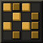
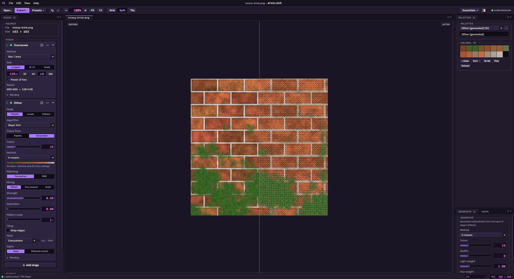
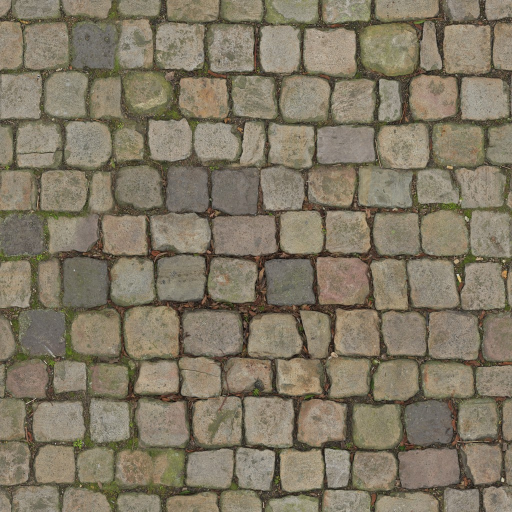
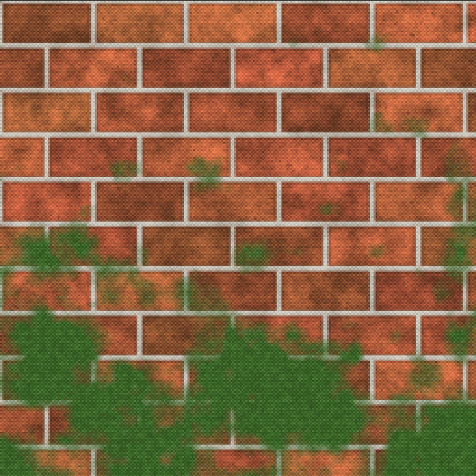
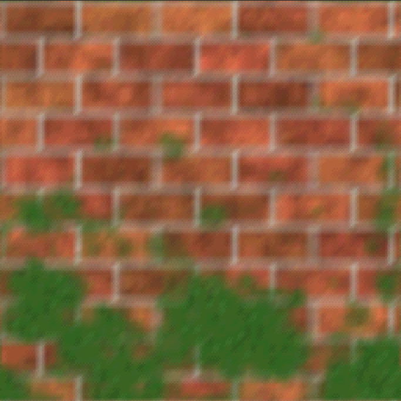
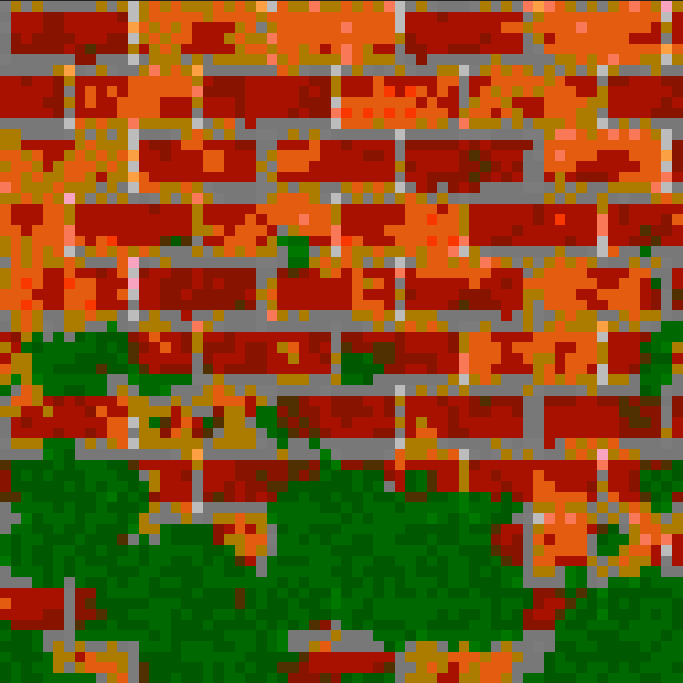
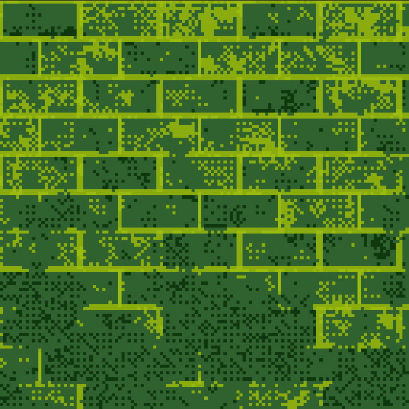
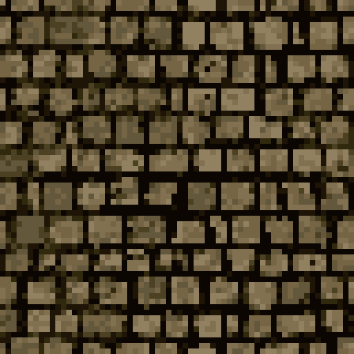

<div align="center">



# 4FXELIZER

**Turn high-res textures into crunchy PSX-style low-res, palettized, dithered ones.**

[](https://github.com/forfex/4fxelizer/actions/workflows/ci.yml)
[](https://github.com/forfex/4fxelizer/releases/latest)


[**Download**](https://github.com/forfex/4fxelizer/releases/latest) · [**Website**](https://forfex.github.io/4fxelizer/) · [Roadmap](docs/PLAN.md)



</div>

## Gallery

One 1024×1024 source texture through the built-in presets:

| Source | PSX 8bpp | PSX 4bpp | N64 |
|:--:|:--:|:--:|:--:|
|  |  |  |  |

| NES-ish | Game Boy | Crunchy |
|:--:|:--:|:--:|
|  |  |  |

## Install

Grab the installer for your OS from the [latest release](https://github.com/forfex/4fxelizer/releases/latest):
Windows setup `.exe`, macOS `.dmg` (Apple Silicon and Intel), Linux `.AppImage` or `.deb`.
Builds are not code-signed yet: Windows SmartScreen may warn (More info › Run anyway), and on macOS, if the app is
reported as damaged, run `xattr -cr /Applications/4FXELIZER.app`. A GPU with WebGPU is required.

## What it does

Load a texture (drag and drop, or **File › Open**), then shape it with a reorderable stack of stages:

- **Adjust**: brightness, contrast, gamma, saturation, hue, levels, sharpen.
- **Downscale**: nearest, bilinear, bicubic, box, Lanczos, dominant color, median, edge-preserving,
  contrast-aware; longest side / exact size / scale, optional power-of-two.
- **Upscale**: enlarge ×2–×16 or back to the original size with the N64 3-point filter, bilinear, bicubic,
  sharp bilinear, Lanczos, Scale2x/Scale3x (EPX, pixel art) or nearest (optional edge wrap for tiling textures). Downscale → Dither → Upscale gives the N64 blur.
- **Quantize**: snap to a palette (perceptual OKLab or RGB matching) or to N levels per channel (32 = PSX 15-bit).
- **Dither**: ordered (Bayer 2×2–16×16, blue noise, white noise, IGN, clustered dots, halftone, lines, N64 magic square) or
  error diffusion (Floyd–Steinberg, Atkinson, Jarvis–Judice–Ninke, Stucki, Burkes, Sierra ×3); to palette,
  to levels, or pattern only. Palette mixing: offset, two nearest or Knoll. Saturation, and a mask
  (edges, flats, shadows, midtones, highlights, saturated, grays) with strength, gamma and a mask view.

Every stage has on/off, opacity and a blend mode; click a stage to preview the image at that point.
Quantize and Dither take their colors from a **palette** or a **generated** palette (2–8192 colors, built
automatically from the stage's input). Palettes are shared resources: generate them from the image
(median cut, Wu, octree or k-means), start from a built-in (PICO-8, NES, Game Boy, CGA, C64, …), import
`.hex/.gpl/.pal/.act/.ase`, edit and lock colors, or pick colors from the image with the eyedropper
(**Pick**, or Alt+click the viewer).
**Presets** (toolbar › Presets) save the whole stack to reuse on other textures; built-ins include PSX 8bpp/4bpp,
PSX 15-bit, N64, NES-ish, Game Boy and Crunchy. Presets are `.4fxpreset` files you can share.
Grid, split view, the export format and the window size and position are remembered between sessions.
**File › Export** writes PNG, TGA or BMP, full color or indexed (palette order kept, transparency at index 0;
BMP has no transparency).
Undo/redo covers the stack and palettes. Hover a slider for a second (or click it) to adjust it with the mouse wheel.

## Development

```bash
npm install          # also downloads the Electron binary (postinstall)
npm run dev          # app with hot reload
npm test             # unit tests (vitest)
npm run typecheck
npm run build        # typecheck + production bundles in out/
npm run dist         # installer for the current OS (dist/)
```

## Verifying WebGPU on a machine

```bash
npm run build
npx electron . --gpu-report
```

This runs headless: it collects adapter info and limits, runs a real
upload → compute → readback test, writes `4fxelizer-gpu-report.json`, and exits 0 on success.
A packaged app accepts the same flag (`4fxelizer --gpu-report=path.json`). In the app,
**Help › GPU Diagnostics…** shows the same report.

On Linux the app adds `--enable-unsafe-webgpu --enable-features=Vulkan`. Launch with
`FXELIZER_NO_GPU_FLAGS=1` to compare against the defaults.

| OS | Status |
|---|---|
| Windows 11 (NVIDIA RTX 5070 Ti, Electron 44 / Chrome 152) | ✅ passes |
| macOS | not yet tested |
| Linux | not yet tested |

## CI and releases

`.github/workflows/ci.yml` runs on every push and pull request, on Windows, macOS and Linux: typecheck,
unit tests, bundle, a headless launch of the app (`scripts/gpu-smoke.mjs`, which uses `--gpu-report`) and an
unpacked package build. The launch must succeed; missing WebGPU only warns, because hosted runners have no GPU
(each run uploads the GPU report as an artifact).

`.github/workflows/release.yml` builds the installers (Windows NSIS, macOS dmg for x64 and arm64, Linux
AppImage + deb) and publishes a GitHub release when a `v*` tag is pushed. Bump `version` in `package.json`
first; the tag must match it:

```bash
git tag v0.1.0
git push origin v0.1.0
```

## Layout

```
src/main/            Electron main: window, menu, file dialogs, GPU flags, --gpu-report
src/preload/         window.fx bridge (sandboxed, CommonJS)
src/shared/api.ts    IPC contract shared by main, preload and renderer
src/renderer/src/
  gpu/pass.ts        pass framework: each stage = one WGSL compute function (+ blend, palette, pattern)
  gpu/wgslLib.ts     WGSL helpers shared by all passes (OKLab, palette lookup, dither thresholds, blend)
  gpu/plan.ts        stage-cache planning (pure, unit-tested)
  gpu/chain.ts       runs the stage stack on the GPU with per-stage caching
  gpu/resources.ts   GPU copies of palettes and the blue-noise texture
  gpu/viewer.*       2D viewer renderer: zoom, split view, pixel grid, alpha checker
  gpu/passes/        stages: adjust, downscale, upscale, quantize, dither
  color/             OKLab conversion
  palette/           palette model, generation (worker), file formats, built-ins, auto-regeneration
  dither/            blue-noise generator (void-and-cluster)
  stack/             document ops, presets, built-in presets, order warnings (pure, unit-tested)
  image/             PNG (RGBA + indexed) encoder, TGA decoder, half-float readback
  viewer/viewport.ts zoom/pan math in device pixels
  engine.ts          owns GPU objects; React talks to it
  store.ts           app state + undoable document (zustand)
  components/        stack panel, stage editors, palette panel, export dialog, viewer
  components/ui/     shadcn-style primitives, restyled via tokens
  styles/tokens.css  design tokens: the one place to restyle the app
```

## Notes

- **Vite 7, not 8**: electron-vite 5 supports Vite ≤ 7. Upgrade together when electron-vite 6 is stable.
- **Everything is a devDependency**: the renderer bundles its libraries, and main/preload have
  no runtime deps, so the packaged app ships only `out/`.
- **Adding a stage**: create `gpu/passes/<name>.ts` with `definePass` (a WGSL `run` function,
  a `Params` struct and `pack`), register it in `gpu/passes/index.ts` (`PASSES` + `STAGE_TYPES`),
  and add its settings editor in `components/stages/editors.tsx`.
- **Image values are kept exact**: images decode without color-space conversion or alpha
  premultiplication, stages work in `rgba16float`, and PNG export uses our own encoder
  (canvas encoding would premultiply alpha).

## Website

The landing page lives in `site/` and is deployed to GitHub Pages by `.github/workflows/pages.yml` on pushes to
`master` that touch it. One-time setup: **Settings › Pages › Source: GitHub Actions**.
