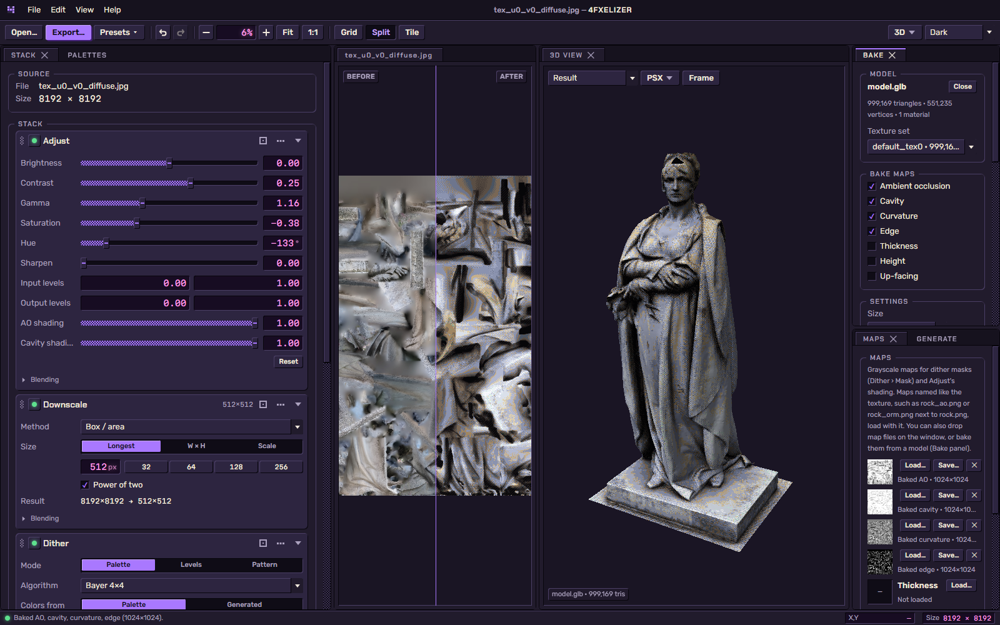
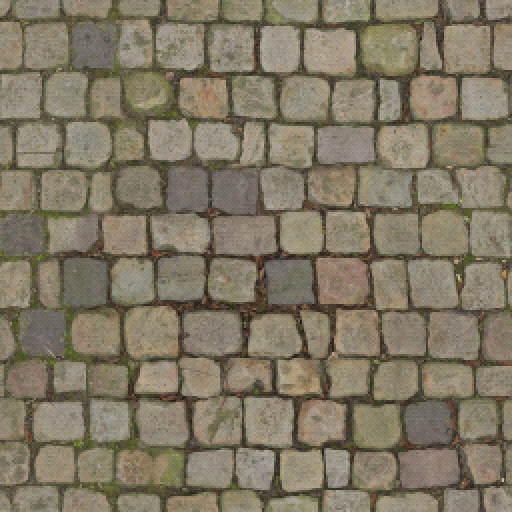
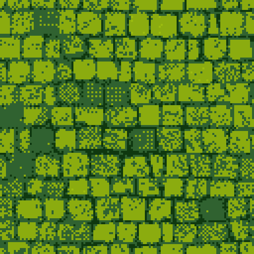

# 4FXELIZER

**Turn high-res textures into crunchy PSX-style low-res, palettized, dithered ones, and see them on your model.**

[**Download**](https://github.com/forfex/4fxelizer/releases/latest) · [**Guide**](guide/README.md) · [Website](https://forfex.github.io/4fxelizer/) · [Report a bug](https://github.com/forfex/4fxelizer/issues)

4FXELIZER is a free desktop app for artists making textures for retro-styled games. Drop in a texture, stack a few
stages (downscale, quantize to a palette, dither) and export something that looks like it came off a PlayStation,
N64 or Game Boy. Load the model it belongs to and watch the result in a PSX-style 3D view as you tweak.

Everything runs on your GPU, so changes show up instantly.

## Highlights

- **A reorderable stage stack**: Adjust, Downscale, Upscale, Quantize and Dither, each with opacity, blend mode and
  a live preview. [More](guide/stages.md)
- **Palettes**: generate them from the image, start from classics (PICO-8, NES, Game Boy, …), import and edit
  them, or let a stage build its own of up to 8192 colors. [More](guide/palettes.md)
- **Every dither you know**: Bayer, blue noise, halftone, the N64 magic square, your own pattern, error diffusion
  from Floyd–Steinberg to Sierra, limited by masks from the image or from AO and cavity maps.
  [More](guide/masks-and-maps.md)
- **3D view and map baking**: glTF, GLB, FBX and OBJ models with switchable PSX quirks (vertex wobble, affine
  warping, 240-line framebuffer), and AO, cavity, curvature and more baked on the GPU. [More](guide/3d.md)
- **Projects, presets and export**: save your whole session as a project; console, computer and stylized
  presets built in; PNG, TGA or BMP, full color or indexed.
  [More](guide/presets-and-export.md)

## Gallery

One texture through the built-in presets:

| Source\* | PSX 8bpp | PSX 4bpp | PSX 15-bit |
|:--:|:--:|:--:|:--:|
|  |  |  |  |

| N64 | NES-ish | Game Boy | Crunchy |
|:--:|:--:|:--:|:--:|
|  |  |  |  |

\* Texture: [PavingStones116](https://ambientcg.com/a/PavingStones116) by ambientCG (CC0).

## Install

Download the installer for your system from the [latest release](https://github.com/forfex/4fxelizer/releases/latest):
Windows `setup.exe`, macOS `.dmg` (Apple Silicon or Intel), or Linux `.AppImage` / `.deb`.

You need a GPU with WebGPU support (any reasonably recent GPU with current drivers). The builds aren't code-signed
yet, so Windows and macOS may warn on first launch; see [Troubleshooting](guide/troubleshooting.md).

## Quick start

1. **Open a texture**: drag it onto the window, or **File › Open Image…** (Ctrl+O).
2. **Pick a preset**: toolbar › **Presets**, for example *PSX 8bpp*.
3. **Tweak**: drag sliders, reorder stages, click a stage's preview button (the square target in its header) to preview the image at that point.
4. **See it in 3D** (optional): drop the model on the window, or **File › Open Model…** (Ctrl+Shift+O).
5. **Export**: **File › Export…** (Ctrl+E).

The [guide](guide/README.md) covers everything else, including [keyboard shortcuts](guide/workspace.md#keyboard-shortcuts).

## Contributing

Build instructions, the project layout and release steps are in [CONTRIBUTING.md](CONTRIBUTING.md).

## License

4FXELIZER is released under the [MIT License](LICENSE). Bundled libraries and fonts are listed with their licenses
in [THIRD_PARTY_NOTICES.md](THIRD_PARTY_NOTICES.md). The app ships no third-party images or textures.

PlayStation, PSX, Nintendo 64, NES and Game Boy are trademarks of their respective owners. They are used here only
to describe the look this tool imitates; 4FXELIZER is not affiliated with or endorsed by them.
